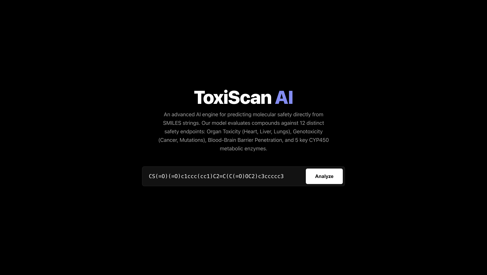
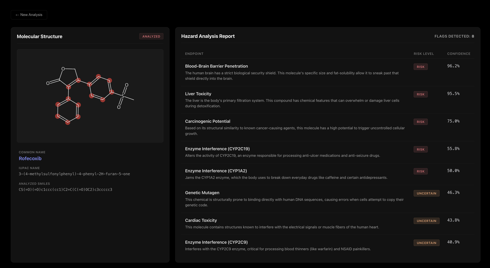
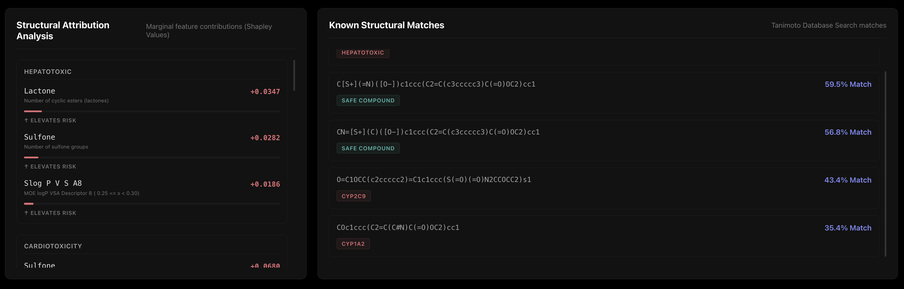

# 🧬 ToxiScan AI: Multi-Task Deep Learning for Pharmacological Toxicity Screening

**🚀 Live Application -> https://toxi-scan-ai-bychaitanya.vercel.app/ **

ToxiScan AI is a production-grade, full-stack Machine Learning pipeline that predicts **11 distinct toxicological endpoints** directly from 2D molecular structures (SMILES). By combining a custom Multi-Task Artificial Neural Network (ANN) with Explainable AI (SHAP) and a blazing-fast memory-mapped similarity search, this tool serves as a high-precision, early-stage safety net for drug discovery.

---

## 📸 Application Interface

---

## 🔬 The Dataset & The Endpoints

A massive bottleneck in computational biology is fragmented data. I engineered a **custom dataset of 38,000+ unique compounds** by aggressively merging, cleaning, and aligning disparate toxicological databases. 

* **Strict Scaffold Splitting (Zero Data Leakage):** To ensure the model evaluates true generalization rather than just memorizing similar molecules, the dataset was split using **Murcko Scaffolds** instead of random train/test splitting. This guarantees that the validation and test sets contain entirely novel chemical core structures the model has never seen during training, proving it actually learns underlying chemical physics.

The model simultaneously predicts the following **11 endpoints**:
`Hepatotoxicity`, `Cardiotoxicity`, `Respiratory Toxicity`, `Blood-Brain Barrier Penetration (BBBP)`, `Mutagenicity`, `Carcinogenicity`, `CYP450 1A2`, `CYP450 2C9`, `CYP450 2C19`, `CYP450 2D6`, and `CYP450 3A4`.

---

## 🧠 Architectural Engineering: Why an ANN?

While tree-based algorithms (LightGBM/XGBoost) are standard for tabular data, they fail to capture the holistic nature of chemistry when trained on 11 isolated targets. 

I architected a **Multi-Task Deep Neural Network (ANN)**. By feeding 2048-bit Morgan Fingerprints and physicochemical descriptors into shared dense layers (128 -> 64 -> 32) before splitting into 11 separate classification heads, the hidden layers are forced to learn a **generalized representation of chemical physics**. The network learns that structural motifs causing Liver Toxicity are mathematically correlated with CYP3A4 inhibition, achieving a synergy impossible in isolated tree models.

### Overcoming Biological Imbalance
1. **Custom Masked Focal Loss:** Biological datasets are plagued by missing labels (`NaNs`) and severe class imbalances (safe compounds outnumber toxins 10:1). I engineered a custom TensorFlow loss function that masks `NaNs` and applies dynamic, mathematically calculated weights to the positive minority classes.
2. **Independent Isotonic Regression Calibration:** Deep neural networks trained on imbalanced data produce distorted, overconfident probability distributions. Before applying decision thresholds, I fitted independent Isotonic Regression calibrators for *each of the 11 endpoints individually* to map the raw model logits into true empirical probabilities.
3. **Endpoint-Specific Dynamic F-Beta Optimization:** In pharmacology, a False Negative (approving a deadly drug) is catastrophic. I bypassed the standard global 0.50 decision boundary. Instead, I manually tuned the F-beta score weights for *each specific endpoint* based on its clinical severity (e.g., severe endpoints like CYP2D6 were assigned a Beta of `1.5`, while Hepatotoxicity was `0.6`). The model dynamically scans thresholds (0.10 to 0.90) for each target independently to aggressively prioritize **Recall** where it matters most.

---

## 📊 True Unbiased Test Set Performance

*Metrics derived from the isolated validation subset after strict calibration and threshold tuning.*

| Endpoint | Applied Threshold | Precision | Recall | F-Beta Score |
| :--- | :--- | :--- | :--- | :--- |
| **Cardiotoxicity** | 0.45 | 0.862 | 0.898 | **0.878** (F0.9) |
| **Respiratory Hazard** | 0.40 | 0.923 | 0.789 | **0.866** (F0.8) |
| **CYP450 2C19** | 0.30 | 0.764 | 0.914 | **0.825** (F0.9) |
| **CYP450 1A2** | 0.35 | 0.770 | 0.874 | **0.813** (F0.9) |
| **Mutagenicity** | 0.45 | 0.768 | 0.836 | **0.801** (F1.0) |
| **BBBP** | 0.45 | 0.913 | 0.718 | **0.804** (F1.0) |
| **CYP450 3A4** | 0.35 | 0.804 | 0.817 | **0.809** (F0.9) |
| **Hepatotoxicity** | 0.45 | 0.692 | 0.811 | **0.720** (F0.6) |

*(Note: The model intentionally operates with high recall/moderate precision on severe targets like Liver Toxicity to act as a conservative screening net.)*

---

## 🧪 Chemical Validation & Model Blindspots

A production model must be transparent about its limitations. I subjected ToxiScan to extreme edge cases to map both its predictive brilliance and its physical constraints.

### 🌟 Where the Model Excels

**1. Vioxx / Rofecoxib (The Billion-Dollar Mistake)**
* **The Reality:** A painkiller recalled from the global market for causing massive cardiovascular blood-clotting cascades.
* **The Model's Output:** Flagged an extreme **95.5% Liver Risk**, a **96.2% BBBP Risk**, and a strong warning for **Cardiac Toxicity (43.8%)**.
* **The SHAP Brilliance:** The Tanimoto Similarity database had a 100% match for this compound, but only knew it as "Hepatotoxic." The neural network ignored the database's limitations and explicitly isolated the **Sulfone group (`+0.0680`)** as the primary mathematical driver of Cardiotoxicity. The AI caught the structural danger that human clinical trials initially missed!

**2. Ketoconazole (The Enzyme Destroyer)**
* **The Reality:** A drug severely restricted by the FDA for shutting down liver enzymes (CYP3A4) and causing liver failure.
* **The Model's Output:** Nailed **CYP3A4 (78%)** and Liver Toxicity.
* **The SHAP Brilliance:** The model explicitly isolated the Universal off-switch for CYP enzymes (the imidazole/triazole ring structure) as the primary mathematical driver of the risk.

**3. MPTP **
* **The Reality:** A synthetic neurotoxin that instantly bypasses the blood-brain barrier (BBBP).
* **The Model's Output:** Caught the **100.0% BBBP Risk**.
* **The SHAP Brilliance:** The Tanimoto similarity database had *zero* matches for this compound (<38% similarity). The Neural Network ignored the database and mathematically derived the 100% BBBP purely by calculating the topological polar surface area (TPSA) and lipophilicity.

### ⚠️ Acknowledged 2D Model Limitations
Because the pipeline converts 3D molecules into 2D topological arrays (Morgan Fingerprints), it is subject to fundamental laws of computational chemistry:

**1. The Chirality Constraint (Thalidomide)**
* **The Issue:** Thalidomide has a "Left" (toxic teratogen) and "Right" (safe sedative) 3D mirror image. Because 2D SMILES strings lack depth, the model averages the risk, throwing widespread uncertain flags. It correctly identifies the reactive glutarimide ring but cannot definitively separate the stereoisomers.

**2. Biological Efflux Pumps (Terfenadine)**
* **The Issue:** Terfenadine is highly fat-soluble. By pure thermodynamic math, it *should* easily cross the Blood-Brain Barrier, and the model flags it for **96.2% BBBP Risk**.
* **The Reality:** The human brain has an active 3D biological pump (P-glycoprotein) that instantly ejects it back into the blood. Because 2D ML models calculate passive physical diffusion rather than active biological protein transport, it natively overpredicts BBBP for P-gp substrates.

**3. The Inorganic Heavy Metal Bypass (Cisplatin)**
* **The Issue:** Morgan Fingerprint bit-vectors are highly optimized for organic carbon scaffolds. Heavy metals (Platinum, Mercury, Lead) often yield blank vectors, causing the ML model to silently classify deadly inorganic poisons as "Safe."
* **The Engineering Fix:** I implemented a hardcoded RDKit atomic iteration layer at the very start of the API. If atoms like `[Pt]`, `[Hg]`, or `[As]` are detected, the pipeline **bypasses the ML inference entirely**, throwing an immediate, hardcoded "Extreme Biohazard / DNA Cross-linking" alert to protect the integrity of the screening tool.

---

*Developed by Chaitanya | IIT Guwahati*

